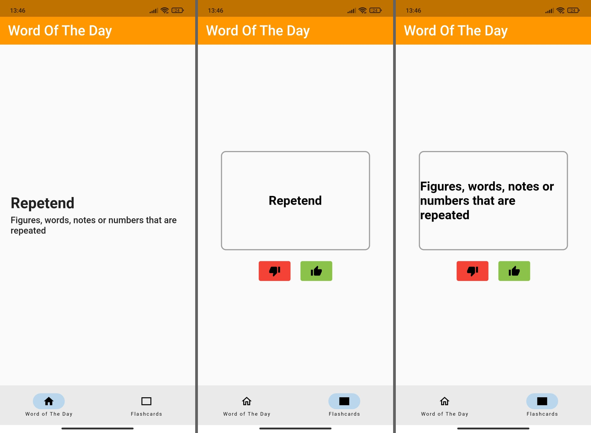

# Word Of The Day App (WIP)

A flutter app that gives you a word of the day, then adds it to the built-in digital [spaced-repetition](https://www.youtube.com/watch?v=-uMMRjrzPmE) flashcards for reviewing later

## Update - 30/11/23
The API that gets the words has been made temporarily unavailable. I'm currently working on other projects so I don't have time to fix this, but I will when I get the chance!

[Uploaded to The Google Play Store](https://play.google.com/store/apps/details?id=com.app.word_of_the_day)

